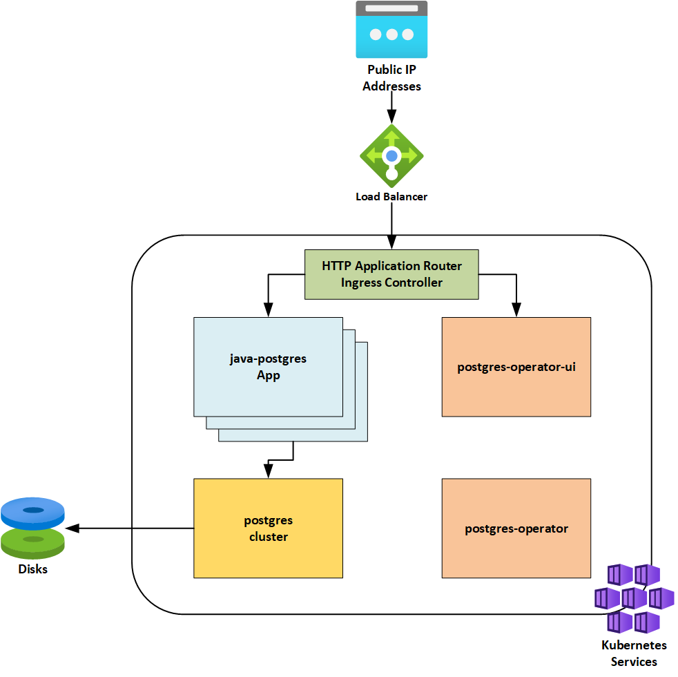

# java-spring-postgresql-operator-in-aks
A demo of a Java Spring Boot application hosted in Azure Kubernetes Service with a PostgreSQL database running in cluster using an operator.

## Solution Diagram



## Testing

Once deployed, there would be 2 endpoints available:

- Operator UI: The administration UI from the Zalando PostgreSQL Operator UI, allowing you to manage PostgreSQL clusters.
- Application: The sample application, a RESTful API for customer entities, with full CRUD operations supported.

You will need to run the ```kubectl get ingress``` command to find the endpoints exposed via the [AKS HTTP Application Routing](https://learn.microsoft.com/en-us/azure/aks/http-application-routing) add-on.

To test the API, you will use the endpoint:

```[app url]/customer/```

You will have support for the following CRUD operations based on the HTTP method:

- GET: Retrieve all customers
- POST: Create a customer
- PUT: Update a customer
- DELETE: Delete a customer

The following is the model for customer:

```json
{
    "firstName": "Joe",
    "lastName": "Black",
    "email": "joe.black@email.com",
    "address": "US"
}
```

## Credits

- [Postgres-Operator by Zalando](https://operatorhub.io/operator/postgres-operator)
- [Postgres operators in OperatorHub](https://operatorhub.io/?keyword=postgres)
